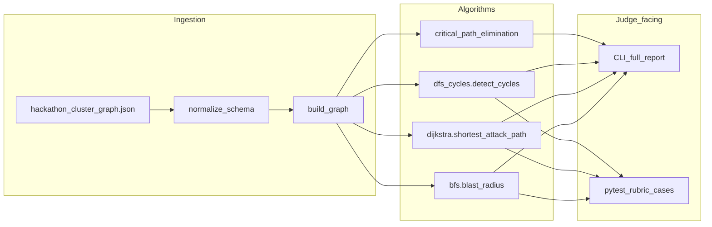

# Hackathon rubric compliance and gap status

This document maps the **organizer scoring rubric** (see reference PDF location below), **[mock-cluster-graph.json](mock-cluster-graph.json)**, and **[sample-output.txt](sample-output.txt)** to the current **Attack Path Analyzer** codebase. Use it to prioritize work toward full marks.

**Reference rubric (local copy used for this analysis):**  
`c:\Users\agraw\AppData\Roaming\Cursor\User\workspaceStorage\4f2fc144a78fead72c205ff93f337b8b\pdfs\2a59e690-115e-484c-829d-ed67b03013bb\scoring-rubric.pdf`  

The PDF notes that the **official** rubric is distributed by hackathon organizers; treat that as authoritative if it differs.

---

## Executive summary

| Deliverable | Weight | Status (this repo) |
|-------------|--------|---------------------|
| 1. Working CLI + ingestion + E2E | 30% | **Missing / partial** — REST API instead of required CLI flags; hackathon JSON not normalized on ingest |
| 2. Kill chain report | 25% | **Partial** — AI/PDF/narrative paths exist; rubric-style **text** report with exact sections and per-path remediation not guaranteed |
| 3. Algorithm unit tests | 20% | **Missing** — no pytest suite for BFS/Dijkstra/DFS against rubric test IDs |
| 4. Critical node (path elimination) | 15% | **Misaligned** — **betweenness centrality** is primary; rubric wants **all simple paths** source→sink with removal-and-recount |
| 5. Code quality & docs | 10% | **Partial** — strong product docs; organizer **schema** + **CLI** README expectations not fully met |

**Bonuses (+15, non-substitutable):** B1 interactive graph (Cytoscape UI) aligns loosely with visualization bonus; B2 NVD/CVE ([`backend/app/services/cve_service.py`](../backend/app/services/cve_service.py)); B3 temporal/diff ([`backend/app/services/graph_diff_service.py`](../backend/app/services/graph_diff_service.py), history). Bonuses do not replace core deliverables.

---

## Rubric scorecard (detailed)

Legend: **Met** = matches rubric as-is; **Partial** = implemented but incomplete or different interface; **Missing** = not present.

### Deliverable 1 — Working CLI tool (30 marks)

| ID | Criterion | Status | Evidence | Gap / next action |
|----|-----------|--------|----------|-------------------|
| 1.1 | Parse `cluster-graph.json`; preserve node/edge attributes; correct counts (40+ nodes) | **Partial** | [`backend/app/core/graph_builder.py`](../backend/app/core/graph_builder.py), [`backend/app/core/parser.py`](../backend/app/core/parser.py) (kubectl path) | Add **normalizer** for organizer JSON (`name`, `risk_score`, `relationship`, `cves`, `is_source`/`is_sink`, edge `cve`/`cvss`). Today `build_graph` expects `label`, `risk`, `relation`; unmapped fields are dropped or defaulted. |
| 1.2 | CLI: `--blast-radius`, `--source`/`--target`, `--cycles`, `--critical-node`, `--full-report`; `--help`; errors/exit codes | **Missing** | Algorithms invoked via FastAPI: [`routes_blast.py`](../backend/app/api/routes_blast.py), [`routes_attack.py`](../backend/app/api/routes_attack.py), [`routes_cycles.py`](../backend/app/api/routes_cycles.py), [`routes_critical.py`](../backend/app/api/routes_critical.py) | Add `python -m app.cli` (or similar) with rubric flags; map to existing services/algorithms. |
| 1.3 | E2E on mock: 6 pre-planted paths, cycle, critical node, no crash, &lt; 60s | **Partial** | Mock = [`MOCK_SCENARIO`](../backend/app/config.py) → Nokia-style scenario, not organizer file by default | Point mock mode at normalized [mock-cluster-graph.json](mock-cluster-graph.json) and validate counts against rubric Section 6 / sample output. |

### Deliverable 2 — Kill chain report (25 marks)

| ID | Criterion | Status | Evidence | Gap / next action |
|----|-----------|--------|----------|-------------------|
| 2.1 | Correct sequences, hop counts, cumulative risk (±0.1), CVE on edges, paths sorted by risk ascending | **Partial** | [`backend/app/algorithm/dijkstra.py`](../backend/app/algorithm/dijkstra.py), [`attack_service.py`](../backend/app/services/attack_service.py) | Rubric **Path #1** example is **one** shortest weighted path (DIJK-1 style). [sample-output.txt](sample-output.txt) lists **18** paths (all source→sink simple paths, sorted). **Clarify with organizers** which definition is graded; implement/report accordingly. |
| 2.2 | Sections: Attack Paths, Blast Radius, Cycles, Critical Node, Summary; severity labels | **Partial** | [`report_export_service.py`](../backend/app/services/report_export_service.py) (PDF), UI panels | Add plain-text `--full-report` matching sample structure if CLI is required. |
| 2.3 | Actionable remediation **per** path / cycle / critical node | **Partial** | [`remediation_service.py`](../backend/app/services/remediation_service.py) | Extend kill-chain **text** output so each listed path has specific remediation (rubric examples: RoleBinding removal, patch CVE, break cycle). |

### Deliverable 3 — Algorithm correctness (20 marks)

| ID | Criterion | Status | Evidence | Gap / next action |
|----|-----------|--------|----------|-------------------|
| 3.1 | BFS: BFS-1, BFS-2 exact; BFS-3 empty, no crash | **Unknown** | [`backend/app/algorithm/bfs.py`](../backend/app/algorithm/bfs.py) | **No automated tests** found. Add pytest with normalized graph and rubric expected hop layers. |
| 3.2 | Dijkstra: DIJK-1 (24.1 ±0.05), DIJK-2 (32.0); DIJK-3 no path message | **Unknown** | [`dijkstra.py`](../backend/app/algorithm/dijkstra.py) | Same: add pytest; verify IDs match organizer graph (`user-dev1` → `db-production`, etc.). |
| 3.3 | DFS cycles: DFS-1 exactly one cycle `[svc-service-a, svc-service-b]`; no duplicates | **Partial** | [`dfs_cycles.py`](../backend/app/algorithm/dfs_cycles.py) uses `nx.simple_cycles` | On full mock graph, **extra simple cycles** could appear; validate against mock and dedupe/normalize cycle reporting if needed. |

### Deliverable 4 — Critical node analysis (15 marks)

| ID | Criterion | Status | Evidence | Gap / next action |
|----|-----------|--------|----------|-------------------|
| 4.1 | Correct node **web-frontend**; **32 / 46** paths eliminated; top-5 ranking; exclude sources/sinks | **Misaligned** | [`centrality.py`](../backend/app/algorithm/centrality.py) `find_critical_nodes` — **betweenness**, not path elimination | Implement global **removal + recount** over **all** source→sink **simple** paths; exclude `is_source` / `is_sink` nodes per rubric. |
| 4.2 | Copy graph per trial; **all simple paths**; baseline count; restore original | **Partial** | `simulate_node_removal` uses `deepcopy` + `all_simple_paths` — **single** (source, target) pair | Extend to **all** entry/sink pairs (or rubric-defined sets) and pick max eliminations; optional cutoff for large graphs with documented behavior. |

### Deliverable 5 — Code quality & documentation (10 marks)

| ID | Criterion | Status | Evidence | Gap / next action |
|----|-----------|--------|----------|-------------------|
| 5.1 | Readability, docstrings, separated functions, PEP 8 | **Partial / Met** | Backend modules generally modular | Rubric-specific review: magic numbers, dead code (judge as needed). |
| 5.2 | Schema doc: node types, edge relationships, weights, `is_source`/`is_sink`, CVE fields, examples | **Partial** | [`algorithms.md`](../algorithms.md), [`README.md`](../README.md) | Add organizer-focused schema (this doc’s mapping table + optional `CLUSTER_GRAPH_SCHEMA.md`) listing **all** types/relationships in mock JSON. |
| 5.3 | README: pip install, **CLI** examples + output snippets, four algorithms, structure, 5-minute start | **Partial** | [`README.md`](../README.md) — docker/web focused | Add CLI quickstart once CLI exists; mirror rubric examples. |

---

## Organizer JSON ↔ internal graph (field mapping)

| Organizer field (mock JSON) | Internal / `build_graph` expectation | Current behavior |
|----------------------------|--------------------------------------|------------------|
| `nodes[].id` | `id` | Used as node id |
| `nodes[].name` | `label` | Not mapped; label defaults to id → **wrong display names** |
| `nodes[].risk_score` | `risk` | Not mapped; **defaults to 0.0** |
| `nodes[].type` (e.g. `Pod`, `User`) | `type` (code often uses lowercase e.g. `pod`, `user`) | **Mismatch** with [`find_entry_points`](../backend/app/core/graph_builder.py) / [`find_sensitive_targets`](../backend/app/core/graph_builder.py) filters |
| `nodes[].is_source`, `is_sink` | (not stored) | **Dropped** — rubric expects use for CNA exclusions |
| `nodes[].cves` | (not stored) | **Dropped** |
| `edges[].relationship` | `relation` | Not mapped; defaults to **`accesses`** |
| `edges[].weight` | `weight` | Present in mock; **OK** |
| `edges[].cve`, `cvss` | (not stored on edge) | **Dropped** — report cannot annotate hops from graph attrs |
| `edges[].risk` | `risk` | Mock uses weight; **edge `risk`** may be absent — uses default |

**Action:** Implement `normalize_hackathon_graph(raw: dict) -> dict` that produces the shape `build_graph` already accepts **and** attaches extra attrs (e.g. under `metadata` or explicit keys) so CVE/CVSS and flags survive for reporting.

---

## Rubric Path #1 vs sample-output.txt (discrepancy)

| Source | What it describes |
|--------|-------------------|
| **Rubric §2.1 (example Path #1)** | `dev-1` → `web-frontend` [CVE-2024-1234] → `sa-webapp` → `secret-reader` → `db-credentials` → `production-db` — **5 hops**, **Risk 24.1** (sum of edge weights on that path). This matches **single-pair shortest path** semantics (**DIJK-1**: `user-dev1` → `db-production`, cost **24.1**). |
| **[sample-output.txt](sample-output.txt)** | **Section 1** lists **18** attack paths, sorted by **ascending** risk score. **Path #1** is a **3-hop** route to `analytics-db` with score **9.5** — a different enumeration (all simple paths from sources to sinks, not “shortest path for DIJK-1 only”). |

**Implication:** Automated checks must follow the **same definition** judges use. Until confirmed, implement **both** in code behind flags if needed: (a) `dijkstra` shortest path for explicit source/target; (b) full source→sink simple-path enumeration for “kill chain report” section.

---

## Section 6 test case checklist (PDF)

| ID | Algorithm | Input (mock / hidden) | Expected (rubric) | Test in repo |
|----|-----------|------------------------|-------------------|--------------|
| BFS-1 | Blast radius | `pod-webfront`, 3 hops | Specific 13 nodes across 3 layers (PDF) | **No** |
| BFS-2 | Blast radius | `cicd-bot`, 2 hops | `sa-cicd`, `deployer`, `cicd-deploy-token` (+ count per PDF) | **No** |
| BFS-3 | Blast radius | Hidden isolated node | 0 reachable, no crash | **No** |
| DIJK-1 | Dijkstra | `user-dev1` → `db-production` | Path as PDF, **cost 24.1**, CVE on first edge | **No** |
| DIJK-2 | Dijkstra | `internet` → `ns-kube-system` | **Cost 32.0**, via `sa-default` → `cluster-admin` | **No** |
| DIJK-3 | Dijkstra | Hidden no path | Clear message, exit 0 | **No** |
| DFS-1 | Cycles | Full mock | **Exactly 1** cycle: `svc-service-a` ↔ `svc-service-b` | **No** |
| DFS-2 | Cycles | Hidden | 3 cycles, no duplicates | **No** |
| CNA-1 | Critical node | Full mock | **`web-frontend`**, **32 / 46** paths eliminated | **No** |
| CNA-2 | Critical node | Hidden | Correct node + count | **No** |

**Current coverage:** **None** of the above are asserted by a discovered `backend/tests/` suite. Adding `pytest` + normalized fixture from [mock-cluster-graph.json](mock-cluster-graph.json) is required for Deliverable 3.

---

## Penalties and disqualification (checklist)

| Condition (PDF) | Risk | Notes for this repo |
|-----------------|------|---------------------|
| Crash / unhandled exception on mock | −5 | Run E2E after normalizing mock ingest |
| Mutates input `cluster-graph.json` on disk | −3 | Ingestion should **read-only** open files |
| Hardcoded outputs (not computed) | Disqualify deliverable | Avoid echoing fixed path lists |
| Runtime &gt; 5 min on ~40-node mock | −5 | Should be fine; watch `all_simple_paths` blowups |
| Pre-existing K8s scanner plagiarism | Full DQ | Original algorithms + attribution |
| Not runnable on Python **3.10+** without changes | −5 | Confirm `pyproject` / requirements and CI Python version |

---

## Target architecture (rubric-aligned)

---

## Key file index (algorithms & consumers)

| Area | Files |
|------|--------|
| BFS | [`backend/app/algorithm/bfs.py`](../backend/app/algorithm/bfs.py) |
| Dijkstra | [`backend/app/algorithm/dijkstra.py`](../backend/app/algorithm/dijkstra.py) |
| Cycles | [`backend/app/algorithm/dfs_cycles.py`](../backend/app/algorithm/dfs_cycles.py) |
| Critical (current) | [`backend/app/algorithm/centrality.py`](../backend/app/algorithm/centrality.py) |
| Graph build | [`backend/app/core/graph_builder.py`](../backend/app/core/graph_builder.py) |
| Ingestion | [`backend/app/services/ingestion_service.py`](../backend/app/services/ingestion_service.py) |
| Analysis orchestration | [`backend/app/services/analysis_service.py`](../backend/app/services/analysis_service.py) |

---

*Last updated: generated to satisfy hackathon rubric gap documentation plan; update this file as implementation catches up.*
